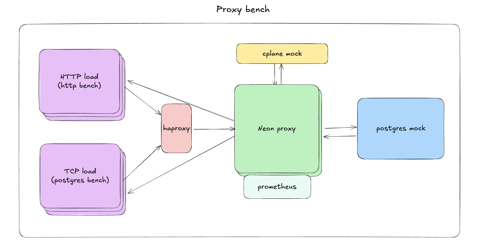

# Neon Proxy Benchmark Suite

Neon's Postgres Proxy has 2 major dependencies.
1. Control Plane
2. Postgres

When benchmarking the proxy service, it might be useful to make sure that these are not the bottlenecks. This repo provides mocked implementations of those two services such that the proxy works.



## Run

```sh
# create TLS certificates
./tls.sh
# Run neon proxy, haproxy, cplane, postgres, and load test
docker compose up -d
```

Or you can simply run all of this with some report via:
```sh
./run.sh
```

To run it bare metal with grafana support use (with specified `$NEON_PROXY_PATH` path):
```sh
./run.sh --bare-metal --grafana
```

Additionally you can set parameters for the load test via the env variables beforehand (per replica):

`$PG_CONNECTION_RATE`, default is 50
`$PG_CONNECTING_MAX`, default is 150
`$PG_CONNECTION_MAX`, default is 250

`$HTTP_CONNECTION_RATE`, default is 50
`$HTTP_CONNECTION_MAX`, default is 5